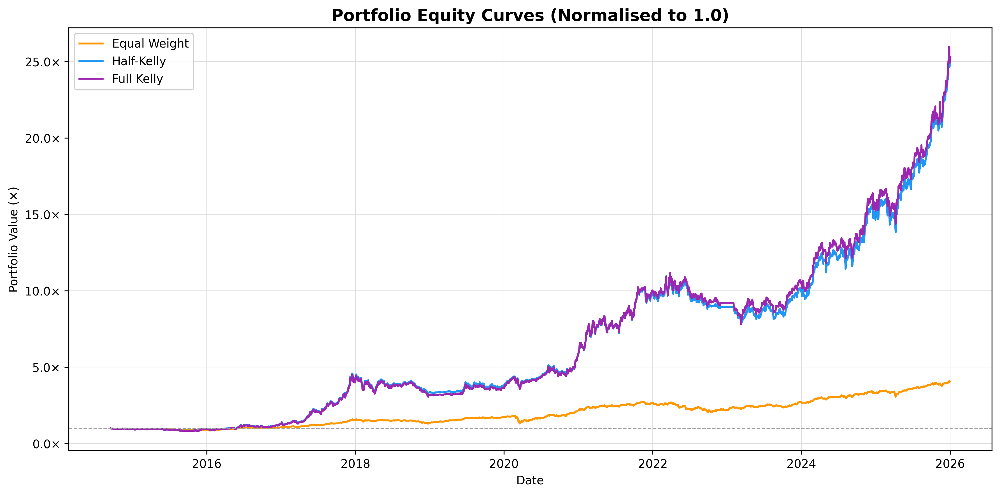
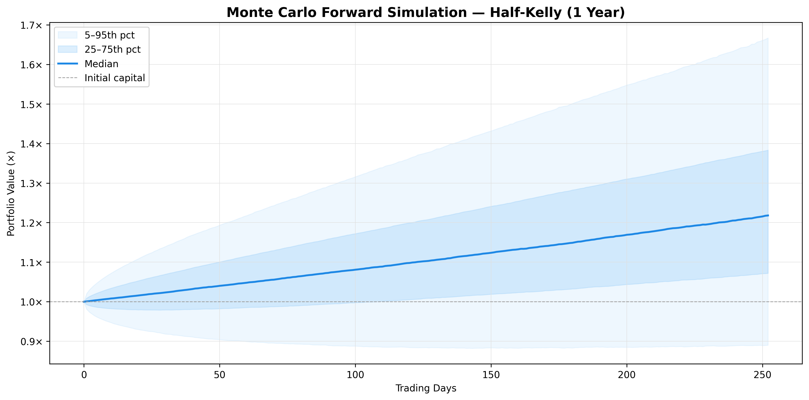
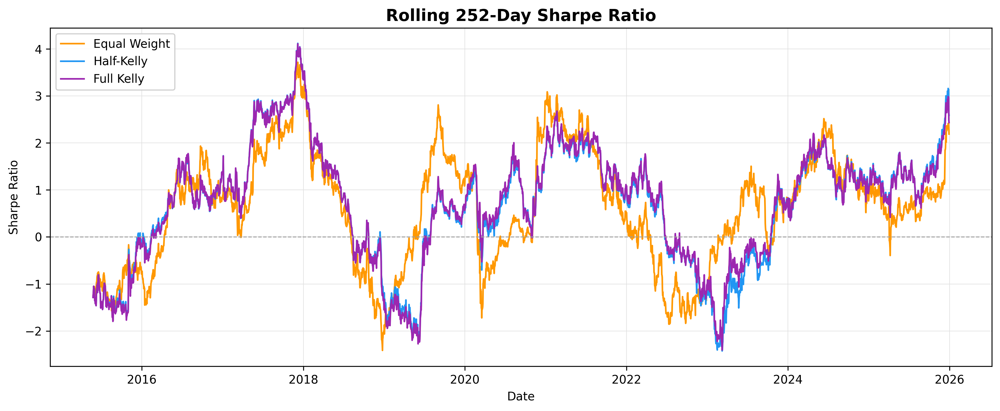
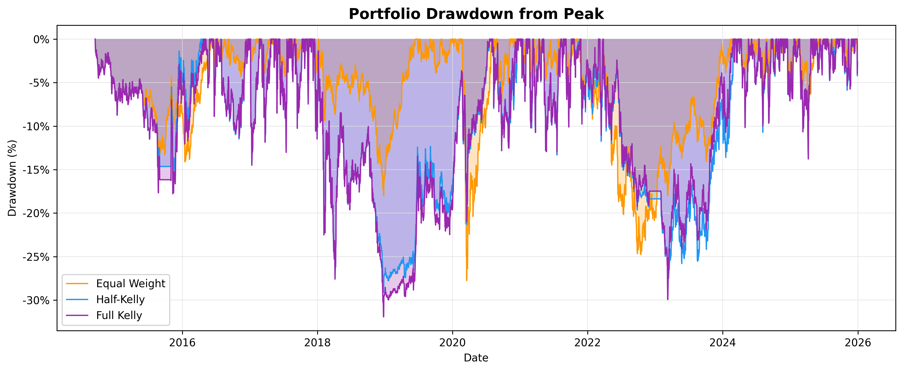
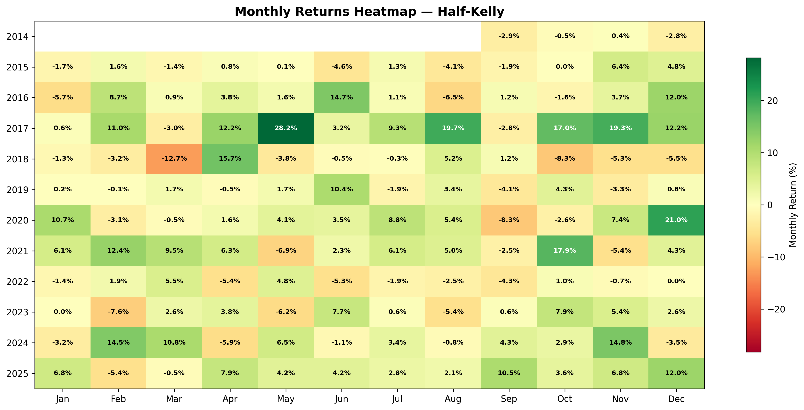
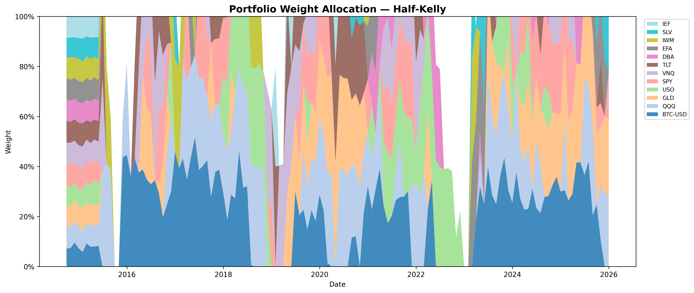
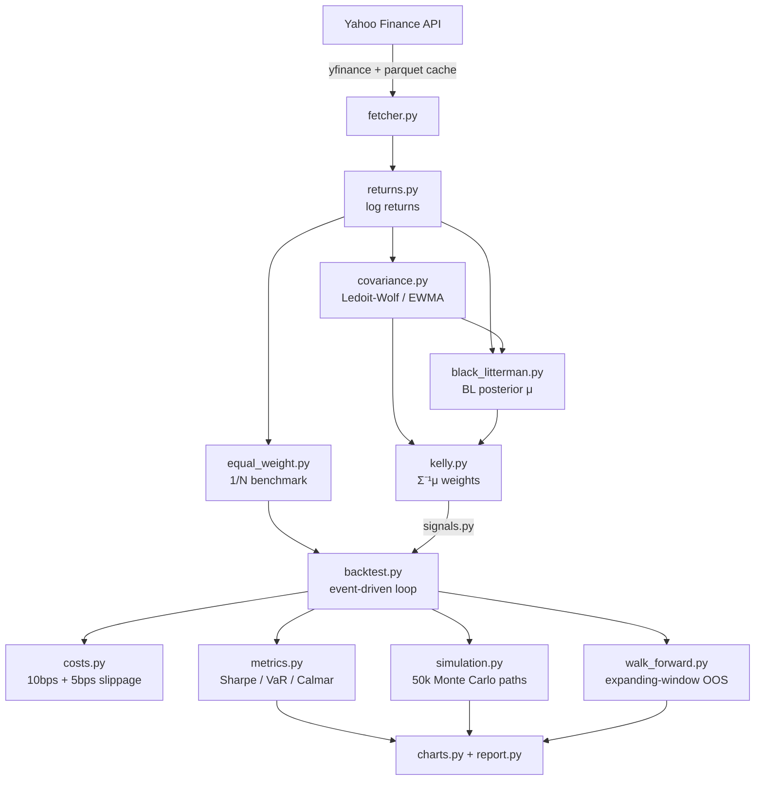

# Quantitative Backtesting & Portfolio Optimization Engine

I built this to find out whether Kelly Criterion portfolio optimization actually beats a simple equal-weight strategy on real market data — not in theory, not on toy examples, but on 12 real assets over 11 years with realistic transaction costs. Then I extended it with a Black-Litterman return estimator and anchored walk-forward validation to check whether the results were genuinely out-of-sample robust. The short answer to both questions is yes. The full infrastructure: event-driven backtester, Ledoit-Wolf covariance, BL posterior returns, parquet caching, Monte Carlo forward simulation, and a walk-forward validation loop that is no-lookahead by construction.

---

## Results

### In-Sample (2014–2025, full period)

| Strategy | CAGR | Sharpe | Sortino | Max Drawdown | Calmar |
|---|---|---|---|---|---|
| Equal Weight (1/N) | 13.2% | 0.478 | 0.458 | -27.8% | 0.321 |
| Half-Kelly (Historical Mean) | 33.0% | 0.921 | 0.977 | -29.1% | 0.747 |
| Full Kelly | 33.1% | 0.916 | 0.970 | -31.9% | 0.683 |
| **BL + Kelly** | **30.8%** | **0.865** | — | **-32.7%** | — |

### Walk-Forward Out-of-Sample (BL + Kelly, OOS start 2016-11)

| | In-Sample | Out-of-Sample | Ratio |
|---|---|---|---|
| Sharpe Ratio | 0.865 | 0.800 | 92% — [OK] |

*Universe: SPY, QQQ, IWM, EFA, TLT, IEF, GLD, SLV, USO, BTC-USD, DBA, VNQ — monthly rebalance — 10 bps commission + 5 bps slippage. Walk-forward uses an expanding window anchored at the first price date; no future data is ever visible to the weight estimator.*

---

## Charts

### Equity Curves (Equal Weight / Half-Kelly / Full Kelly)


### Return Estimator Comparison (Historical Mean vs Black-Litterman)


### In-Sample vs Out-of-Sample Equity Curves (Walk-Forward)


### Monte Carlo Fan Chart (1-Year Forward, 50,000 Paths)


### Rolling 252-Day Sharpe Ratio


### Portfolio Drawdowns


### Monthly Returns Heatmap (Half-Kelly)


### Portfolio Weight Allocation Over Time


---

## Architecture



```
quant-backtest-engine/
│
├── config.py                     # Central configuration (all tunable params)
├── main.py                       # Single entry point — full pipeline
│
├── src/
│   ├── data/
│   │   ├── fetcher.py            # Yahoo Finance ingestion + parquet cache
│   │   └── returns.py            # Log-return computation and alignment
│   │
│   ├── engine/
│   │   ├── backtest.py           # Event-driven backtester core loop
│   │   └── costs.py              # Proportional transaction cost model
│   │
│   ├── optimization/
│   │   ├── covariance.py         # Sample / Ledoit-Wolf / EWMA estimators
│   │   ├── kelly.py              # Multi-asset Kelly criterion optimizer
│   │   ├── black_litterman.py    # BL return estimator (equilibrium + views)
│   │   ├── views.py              # Momentum view generation (P, Q, Ω)
│   │   ├── equal_weight.py       # 1/N benchmark strategy
│   │   └── signals.py            # Signal factories (wraps optimizers)
│   │
│   ├── risk/
│   │   ├── metrics.py            # Sharpe, Sortino, VaR, CVaR, Calmar, ...
│   │   └── regime.py             # Rolling vol regime classifier
│   │
│   ├── monte_carlo/
│   │   └── simulation.py         # Vectorized 50k-path forward simulator
│   │
│   ├── validation/
│   │   ├── walk_forward.py       # Anchored expanding-window OOS validation
│   │   └── oos_metrics.py        # IS vs OOS comparison table
│   │
│   └── visualization/
│       ├── charts.py             # 8 publication-quality matplotlib charts
│       └── report.py             # Text report generator
│
├── tests/                        # 175 pytest tests (100% passing)
├── data/cache/                   # Parquet price cache (git-ignored)
└── output/                       # Charts + report (git-ignored)
```

---

## Quick Start

**Requirements:** Python 3.11+

```bash
git clone https://github.com/schoudhary90210/Quant-Backtest-Engine.git
cd quant-backtest-engine

python3 -m venv venv
source venv/bin/activate        # Windows: venv\Scripts\activate

pip install -r requirements.txt
python main.py
```

Output is written to:
- `output/charts/` — 8 PNG charts at 300 DPI
- `output/report.txt` — full risk report

**Run tests:**

```bash
pytest tests/ -v
```

---

## Configuration

All parameters are in `config.py` — no magic numbers anywhere in the library code:

```python
ASSETS = ["SPY", "QQQ", "IWM", ...]   # 12-asset universe
START_DATE = "2010-01-01"
INITIAL_CAPITAL = 1_000_000
REBALANCE_FREQ = "monthly"             # 'daily' or 'monthly'
TRANSACTION_COST_BPS = 10             # round-trip commission
SLIPPAGE_BPS = 5
KELLY_FRACTION = 0.5                   # half-Kelly
MAX_POSITION_WEIGHT = 0.40            # 40% single-asset cap
MAX_LEVERAGE = 1.5                     # gross exposure cap
COV_METHOD = "ledoit_wolf"            # 'sample', 'ledoit_wolf', 'ewma'
MC_NUM_PATHS = 50_000
BL_RISK_AVERSION = 2.5                # market risk-aversion coefficient δ
BL_TAU = 0.05                         # prior uncertainty scaling
BL_VIEW_LOOKBACK = 252                # momentum window for BL views
```

Pipeline flags in `main.py`:

```python
WALK_FORWARD = True          # anchored OOS validation (~2 min extra)
RETURN_ESTIMATOR = "black_litterman"  # or "historical_mean"
```

---

## Technical Deep Dive

### Kelly Criterion (`src/optimization/kelly.py`)

The Kelly Criterion provides the theoretically optimal bet size that maximises the long-run geometric growth rate. The multi-asset formulation I implement is **f\* = Σ⁻¹(μ − r)**, where **Σ** is the N×N covariance matrix, **μ** is the vector of expected excess returns, and **r** is the risk-free rate. I solve the system via `numpy.linalg.solve` rather than explicit matrix inversion, falling back to `numpy.linalg.lstsq` when the matrix is near-singular. Constraints are applied after solving: zero out assets with negative excess return, clip each position to `MAX_POSITION_WEIGHT` (40%), then scale if gross exposure exceeds `MAX_LEVERAGE` (1.5×). I default to **Half-Kelly (fraction = 0.5)**, which cuts position sizes in half while retaining most of the geometric-growth advantage — the results show essentially identical CAGR to Full Kelly with a materially better Calmar ratio.

### Ledoit-Wolf Covariance Shrinkage (`src/optimization/covariance.py`)

The sample covariance matrix has estimation error that grows with N (assets) relative to T (observations), producing extreme and unstable weights. The Ledoit-Wolf (2004) estimator shrinks the sample covariance **S** toward a scaled identity target: **Σ̂ = (1 − α)S + αμI**, where the optimal shrinkage intensity **α** is derived analytically without cross-validation. Three swappable estimators — `SampleCovariance`, `LedoitWolfCovariance`, and `EWMACovariance` — all implement the same `estimate(returns) → pd.DataFrame` protocol and are drop-in replaceable via the `COV_METHOD` config key. Ledoit-Wolf is the default because it consistently produces better-conditioned matrices even in the typical regime of 252 observations × 12 assets.

### Black-Litterman Return Estimator (`src/optimization/black_litterman.py`, `views.py`)

The Black-Litterman model replaces raw historical means with a Bayesian posterior that blends an equilibrium prior with investor views. The equilibrium prior is **π = δΣw_mkt**, where w_mkt are market-cap proxy weights from `config.MARKET_CAP_WEIGHTS` and δ = 2.5. I generate absolute momentum views automatically: **P = I** (identity pick matrix), **Q** = trailing 252-day annualised log returns, and **Ω** diagonal with scale = (1/view_confidence − 1)×τ×diag(Σ), giving the prior 75% weight (view_confidence=0.25). The posterior is **μ_BL = [(τΣ)⁻¹ + P'Ω⁻¹P]⁻¹[(τΣ)⁻¹π + P'Ω⁻¹Q]**, solved entirely via `np.linalg.solve` with no explicit matrix inversion. In practice, BL + Kelly reduces drawdowns slightly vs. raw historical mean + Kelly, at a modest reduction in raw CAGR (30.8% vs. 33.0%), because the equilibrium prior prevents the optimizer from over-allocating to assets with large recent momentum.

### Walk-Forward Out-of-Sample Validation (`src/validation/walk_forward.py`)

The walk-forward engine re-estimates Kelly weights monthly using an expanding window anchored at the first price date — the training slice for any rebalance date is strictly `log_returns.loc[:date]`, so future data is structurally impossible to observe. The `_walk_forward_signal` ignores the `prices` argument entirely; weights are pre-computed and only looked up at runtime, making lookahead impossible by construction (verified by a unit test that appends 200%/day synthetic returns after a split date and confirms identical weights at all common dates). The minimum training window is 756 days (~3 years), so the first valid OOS rebalance is 2016-11. The OOS Sharpe (0.800) is 92% of the IS Sharpe (0.865), well above the 50% overfitting threshold, confirming the strategy generalises beyond the in-sample period.

### Monte Carlo Simulation (`src/monte_carlo/simulation.py`)

The Monte Carlo engine generates 50,000 forward paths of 252 trading days using a fully vectorised NumPy implementation — all 50,000 × 252 draws happen in a single `numpy.random.Generator.multivariate_normal` call. It operates on the historical portfolio return distribution (fitted mean and Ledoit-Wolf covariance), producing terminal wealth distributions, per-path maximum drawdown computed via vectorised cumulative-maximum, and underwater period statistics. The random seed is fixed via `config.MC_SEED` for full reproducibility. The 5th–95th percentile band and median path are rendered in `plot_monte_carlo_fan`.

---

## License

MIT License

Copyright (c) 2026 Siddhant Choudhary

Permission is hereby granted, free of charge, to any person obtaining a copy of this software and associated documentation files (the "Software"), to deal in the Software without restriction, including without limitation the rights to use, copy, modify, merge, publish, distribute, sublicense, and/or sell copies of the Software, and to permit persons to whom the Software is furnished to do so, subject to the following conditions:

The above copyright notice and this permission notice shall be included in all copies or substantial portions of the Software.

THE SOFTWARE IS PROVIDED "AS IS", WITHOUT WARRANTY OF ANY KIND, EXPRESS OR IMPLIED, INCLUDING BUT NOT LIMITED TO THE WARRANTIES OF MERCHANTABILITY, FITNESS FOR A PARTICULAR PURPOSE AND NONINFRINGEMENT. IN NO EVENT SHALL THE AUTHORS OR COPYRIGHT HOLDERS BE LIABLE FOR ANY CLAIM, DAMAGES OR OTHER LIABILITY, WHETHER IN AN ACTION OF CONTRACT, TORT OR OTHERWISE, ARISING FROM, OUT OF OR IN CONNECTION WITH THE SOFTWARE OR THE USE OR OTHER DEALINGS IN THE SOFTWARE.
