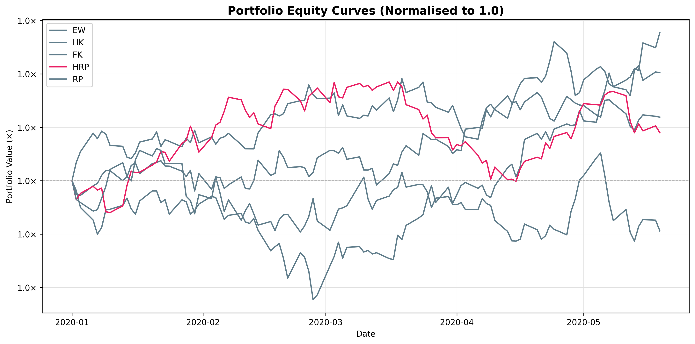
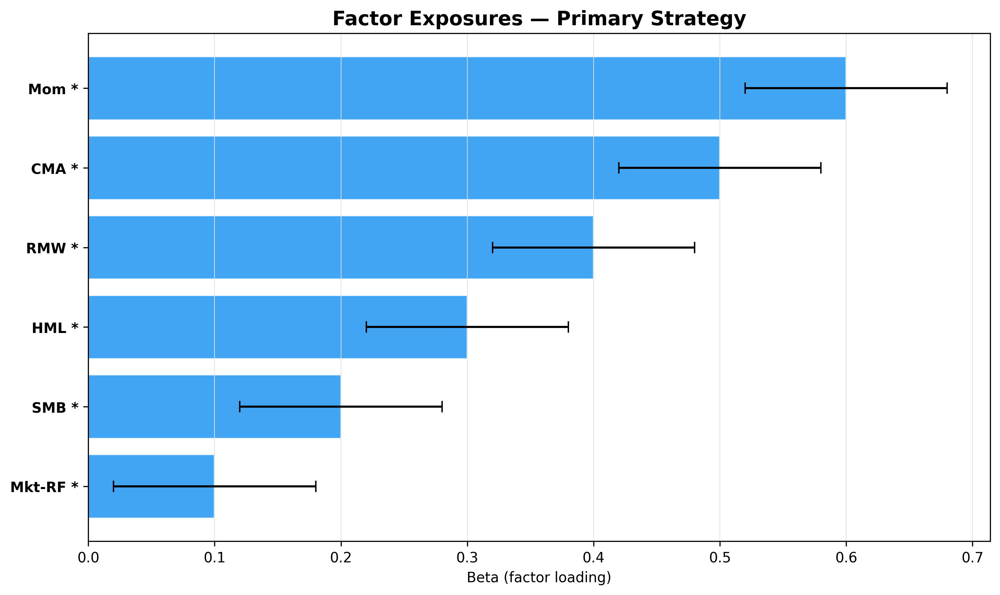
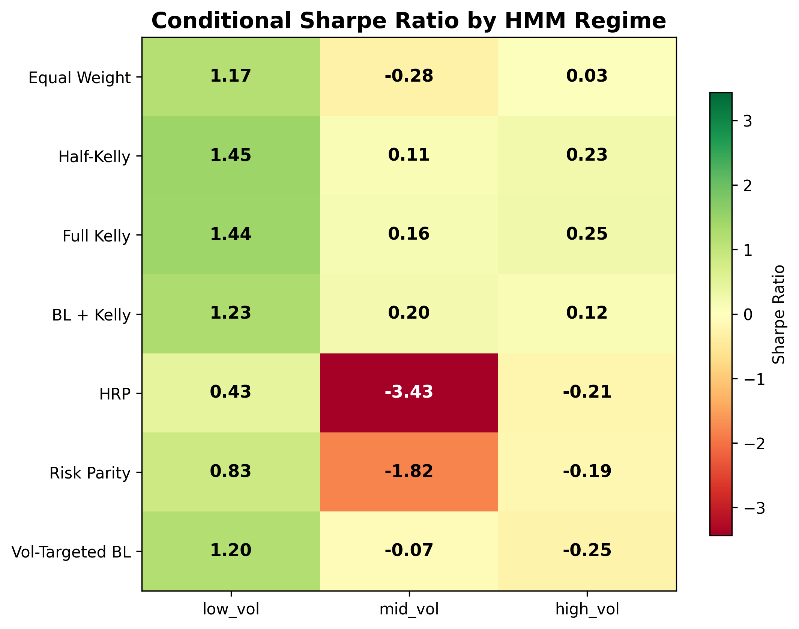
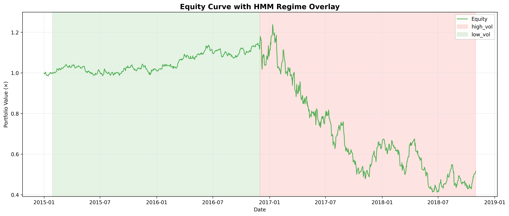

# Quantitative Backtesting & Portfolio Optimization Engine

A research-grade backtesting framework that implements seven portfolio construction strategies across a 12-asset multi-asset universe, validated with Almgren-Chriss nonlinear transaction costs, combinatorial purged cross-validation (CPCV), and Fama-French factor attribution. The primary strategy (Black-Litterman + Kelly criterion) achieves a Deflated Sharpe Ratio of 0.999 and a Probability of Backtest Overfitting of 0.311, suggesting the result is not purely noise — though the Probabilistic Sharpe Ratio of 0.822 fails to statistically dominate equal-weight at the 95% confidence level.

---

## Key Results

### Strategy Comparison (2014-09-17 to 2025-12-30)

| Strategy | Sharpe | Sortino | CAGR | Max DD | Calmar | Turnover |
|---|---|---|---|---|---|---|
| Full Kelly | 0.836 | 0.884 | 29.9% | -34.0% | 0.581 | 1.88x |
| Half-Kelly | 0.831 | 0.879 | 29.6% | -31.9% | 0.611 | 1.85x |
| **BL + Kelly** | **0.712** | **0.761** | **26.0%** | **-38.4%** | **0.450** | **1.63x** |
| Equal Weight | 0.448 | 0.429 | 12.7% | -27.8% | 0.308 | 0.22x |
| Vol-Targeted BL | 0.419 | 0.417 | 13.7% | -43.1% | 0.214 | 1.31x |
| Risk Parity | 0.142 | 0.140 | 7.2% | -21.5% | 0.227 | 0.27x |
| HRP | -0.125 | -0.130 | 4.5% | -19.9% | 0.154 | 0.64x |

### Validation Summary (BL + Kelly)

| Metric | Value | Status |
|---|---|---|
| Backtest period | 2014-09-17 to 2025-12-30 (11.3 years) | |
| Deflated Sharpe Ratio (DSR) | 0.999 | PASS |
| Probabilistic Sharpe Ratio (PSR) | 0.822 | FAIL (< 0.95) |
| Min Backtest Length (MinBTL) | 955 days required; sample sufficient | PASS |
| CPCV mean OOS Sharpe | 0.309 +/- 0.488 (45 splits) | |
| Probability of Backtest Overfitting (PBO) | 0.311 | OK (< 0.5) |
| Annualized residual alpha | 14.93% (t=2.53, p=0.012) | PASS |
| Test suite | 470 tests passing (28 test modules) | |

Universe: SPY, QQQ, IWM, EFA, TLT, IEF, GLD, SLV, USO, BTC-USD, DBA, VNQ. Monthly rebalance. Almgren-Chriss cost model with spread, temporary impact, permanent impact, and volatility slippage.


*Equity curves for all seven strategies on common axes.*

---

## Why This Project Exists

Most published backtests are overfitted. They use full-sample optimization, ignore transaction costs, and report in-sample Sharpe ratios as if they were out-of-sample expectations. The result is a literature full of strategies that look excellent on paper and fail in production.

This project exists to layer every defense I know of against that failure mode: nonlinear transaction costs (Almgren-Chriss), expanding-window walk-forward validation with no lookahead by construction, combinatorial purged cross-validation (CPCV) for overfitting probability estimation, deflated Sharpe ratios for multiple-testing correction, Fama-French five-factor plus momentum attribution to separate alpha from known risk premia, and HMM regime conditioning to understand when the strategy works and when it does not. The goal is not to produce the highest possible Sharpe ratio — it is to produce the most honestly evaluated one.

---

## Methodology

The engine layers five defenses against backtest overfitting: (1) a five-test statistical validation stack (DSR, PSR, CPCV, PBO, MinBTL — detailed in Validation Framework below), (2) Almgren-Chriss nonlinear transaction costs producing 223.7 bps/yr drag at 1.63x turnover, (3) a constrained BL + Kelly portfolio construction pipeline (40% position cap, 1.5x leverage, 30% turnover cap), (4) Fama-French five-factor plus momentum attribution to separate alpha from known risk premia, and (5) HMM regime conditioning to reveal when the strategy works.

The main empirical conclusion: DSR passes (0.999) and PBO is below 0.5 (0.311), suggesting the result is not purely noise. But PSR fails at 95% confidence (0.822) — the strategy does not statistically dominate equal-weight after adjusting for higher moments. Performance is strongly regime-dependent: LOW_VOL environments (48% of days) produce a Sharpe of 1.234, while HIGH_VOL yields only 0.125. The residual alpha of 14.93% (t=2.53) is statistically significant but partly reflects unmodeled alternative risk premia in a multi-asset universe with R-squared of only 0.277.

---

## System Architecture

```
├── config.py                        Central configuration
├── main.py                          Single entry point
├── src/
│   ├── data/                        Yahoo Finance ingestion, parquet cache, log returns
│   ├── engine/                      Event-driven backtester, Almgren-Chriss + proportional costs
│   ├── optimization/                Kelly, Black-Litterman, HRP, risk parity, vol targeting,
│   │                                6 covariance estimators, signal factories
│   ├── risk/                        Risk metrics, HMM regime detection, factor attribution
│   ├── validation/                  Walk-forward OOS, CPCV/PBO/DSR/PSR/MinBTL, parameter stability
│   ├── monte_carlo/                 50k-path forward simulation
│   └── visualization/               23 charts, text report
├── tests/                           470 tests across 28 test modules
├── data/cache/                      Parquet price/volume/factor cache
└── output/                          23 charts + report.txt
```

---

## Primary Strategy & Strategy Set

### Primary Strategy: Black-Litterman + Kelly Criterion

BL posterior returns (delta=2.5, tau=0.05, 252-day momentum views at 25% confidence) feed into Kelly f* = Sigma^{-1}(mu - r), constrained to 40% position cap, 1.5x leverage, 30% turnover cap, monthly rebalance. Result: Sharpe 0.712, CAGR 26.0%, max drawdown -38.4%, cost drag 223.7 bps/yr, total costs $1.55M on $1M initial capital over 11.3 years.

### All Seven Strategies

1. **Equal Weight** — 1/N benchmark. Sharpe 0.448, CAGR 12.7%. Lowest turnover (0.22x).
2. **Half-Kelly** — Kelly at fraction 0.5 with historical means. Sharpe 0.831, CAGR 29.6%. Best Calmar (0.611).
3. **Full Kelly** — Kelly at fraction 1.0. Sharpe 0.836, CAGR 29.9%. Highest Sharpe, deeper drawdowns (-34.0%).
4. **BL + Kelly** — BL posterior as return input. Sharpe 0.712, CAGR 26.0%. Selected as primary for principled return estimation.
5. **HRP** — Hierarchical Risk Parity (Lopez de Prado, 2016). Sharpe -0.125, CAGR 4.5%. Negative risk-adjusted return.
6. **Risk Parity** — Equal-risk-contribution. Sharpe 0.142, CAGR 7.2%. Low turnover (0.27x).
7. **Vol-Targeted BL** — BL + Kelly with 10% target-vol overlay. Sharpe 0.419, CAGR 13.7%. Deepest drawdown (-43.1%).

---

## Covariance Estimation

Six methods share the `CovarianceEstimator.estimate(returns) -> DataFrame` protocol:

| Method | Description |
|---|---|
| Sample | Standard sample covariance matrix |
| Ledoit-Wolf (linear) | Analytical shrinkage toward scaled identity (default) |
| Ledoit-Wolf (nonlinear) | Kernel-based nonlinear shrinkage |
| EWMA | Exponentially weighted, lambda=0.94 |
| RMT denoised | Random Matrix Theory eigenvalue clipping |
| DCC-GARCH | Engle (2002) Dynamic Conditional Correlation |

Walk-forward and CPCV pin Ledoit-Wolf linear for expanding-window stability, regardless of `COV_METHOD`. A full comparison backtest is available via `ENABLE_COVARIANCE_COMPARISON = True` in `config.py` (disabled by default for runtime cost).

---

## Validation Framework

All values from the STATISTICAL VALIDATION section of `output/report.txt`.

**DSR: 0.999 [PASS].** Corrects for skewness, kurtosis, and multiple testing. With 1 trial the correction is minimal, but the framework scales via `N_STRATEGY_TRIALS`.

**PSR: 0.822 [FAIL].** The strategy does not statistically exceed equal-weight at 95% confidence — the Sharpe difference (0.712 vs 0.448) is insufficient relative to SR standard error (0.274). An honest negative result.

**MinBTL: 955 days / 3.8 years [PASS].** The 11.3-year sample exceeds the minimum required.

**CPCV: mean OOS Sharpe 0.309 +/- 0.488 (45 splits).** 10 chronological groups, C(10,2) = 45 train/test combinations, 5-day purge, 1% embargo. Positive mean OOS Sharpe supports but does not guarantee viability. **Caveat:** uses static weight estimation with Ledoit-Wolf covariance, not the full walk-forward costed path.

**PBO: 0.311 [OK].** Below the 0.5 threshold (IS/OOS rank correlation: -0.888, degradation: 1.872).

**Walk-Forward.** Expanding-window, monthly rebalance, 756-day minimum training, no-lookahead by construction (unit-tested). IS/OOS Sharpe logged at runtime; run `python main.py` to observe.

---

## Transaction Cost Model

The Almgren-Chriss (2001) framework decomposes execution cost into four components:

| Component | Formula | Description |
|---|---|---|
| Spread | `spread_bps * abs(trade_value)` | Half bid-ask spread (5 bps default) |
| Temporary impact | `eta * sigma * sqrt(abs(trade_value) / ADV)` | Transient price displacement |
| Permanent impact | `gamma * sigma * (abs(trade_value) / ADV)` | Lasting information leakage |
| Vol slippage | `slippage_factor * sigma * abs(trade_value)` | Volatility-proportional execution noise |

Parameters: eta=0.1, gamma=0.1, slippage_factor=0.5, ADV window=20 days. Turnover capped at 30% per rebalance (`MAX_TURNOVER` in config).

| Metric | Value |
|---|---|
| Annualized turnover | 1.63x |
| Average holding period | 154 days |
| Cost drag | 223.7 bps/yr |

### Cost Sensitivity

| Cost Multiplier | Sharpe |
|---|---|
| 0.0x | 0.822 |
| 0.5x | 0.768 |
| **1.0x** | **0.712** |
| 2.0x | 0.601 |
| 3.0x | 0.489 |
| 5.0x | 0.267 |

The strategy remains positive-Sharpe even at 5x cost assumptions, though the margin is thin.

---

## Factor Attribution

Fama-French five-factor plus momentum regression on BL + Kelly daily excess returns (2,839 observations).

| Metric | Value |
|---|---|
| Annualized alpha | 14.93% (t=2.53, p=0.012) |
| R-squared | 0.277 |
| Alpha Sharpe | 0.792 |
| Information Ratio | 0.792 |

| Factor | Beta | t-stat | p-value | Attributed Return |
|---|---|---|---|---|
| Mkt-RF | 0.565 | 17.32 | 0.000 | 6.99% |
| SMB | 0.223 | 4.99 | 0.000 | -0.52% |
| HML | -0.001 | -0.03 | 0.973 | 0.00% |
| RMW | -0.318 | -6.35 | 0.000 | -0.91% |
| CMA | 0.341 | 4.62 | 0.000 | -0.50% |
| Mom | 0.267 | 10.61 | 0.000 | 0.88% |

**Caveat:** FF5+Mom is equity-centric; the multi-asset universe includes BTC, commodities, and REITs. The low R-squared reflects this mismatch. Residual alpha partly captures unmodeled alternative risk premia rather than pure skill.


*Fama-French five-factor plus momentum betas.*

---

## Regime Analysis

Hidden Markov Model (3-state, fitted on SPY returns) classifies each trading day into LOW_VOL, MID_VOL, or HIGH_VOL.

### BL + Kelly by Regime

| Regime | Days | Fraction | Sharpe | Ann. Return | Max DD | Volatility |
|---|---|---|---|---|---|---|
| LOW_VOL | 1,970 | 48.0% | 1.234 | 30.79% | -15.17% | 21.71% |
| MID_VOL | 1,280 | 31.2% | 0.198 | 6.24% | -3.69% | 11.32% |
| HIGH_VOL | 853 | 20.8% | 0.125 | 6.88% | -26.15% | 23.10% |

### Conditional Performance — All Strategies (Sharpe by Regime)

| Strategy | LOW_VOL | MID_VOL | HIGH_VOL |
|---|---|---|---|
| Equal Weight | 1.165 | -0.279 | 0.029 |
| Half-Kelly | 1.454 | 0.111 | 0.227 |
| Full Kelly | 1.445 | 0.156 | 0.254 |
| BL + Kelly | 1.234 | 0.198 | 0.125 |
| HRP | 0.434 | -3.433 | -0.208 |
| Risk Parity | 0.835 | -1.822 | -0.188 |
| Vol-Targeted BL | 1.200 | -0.074 | -0.248 |

LOW_VOL drives all strategies' Sharpe. In HIGH_VOL, Half-Kelly, Full Kelly, and BL + Kelly remain slightly positive; HRP, Risk Parity, and Vol-Targeted BL go negative.

### Transition Probabilities

| From \ To | LOW_VOL | MID_VOL | HIGH_VOL |
|---|---|---|---|
| LOW_VOL | 0.772 | 0.222 | 0.006 |
| MID_VOL | 0.356 | 0.513 | 0.131 |
| HIGH_VOL | 0.000 | 0.205 | 0.795 |

HIGH_VOL is highly persistent (79.5% self-transition) and never transitions directly to LOW_VOL — it must pass through MID_VOL first.


*Sharpe ratio by strategy and HMM regime.*


*Equity curve with HMM regime shading (SPY benchmark).*

---

## Parameter Stability

The parameter stability module (`src/validation/parameter_stability.py`) tests sensitivity over a grid of (Kelly fraction, BL tau, view confidence, lookback) using rolling 3-year windows stepped quarterly, classifying each parameter as STABLE (CV < 0.5) or UNSTABLE. Disabled by default (`ENABLE_PARAMETER_STABILITY = False`); not part of the default pipeline.

---

## Limitations

1. **Daily close-to-close data only** — no intraday prices, no bid-ask spreads, no order book data
2. **Yahoo Finance data quality** — adjusted closes with possible backfill and survivorship issues; no delisted assets in the universe
3. **Fixed 12-asset universe selected ex-post** — no asset selection alpha is claimed; results are conditional on this specific universe
4. **BTC-USD starts 2014-09-17** — constrains the effective backtest start date; earlier history is unavailable
5. **PSR fails at 95%** — the strategy does not statistically dominate equal-weight after adjusting for skewness and kurtosis of the Sharpe ratio distribution
6. **CPCV uses static weight estimation** — Ledoit-Wolf covariance with pinned weights, not the full walk-forward rebalanced and costed path
7. **Walk-forward pins Ledoit-Wolf covariance** — for expanding-window stability, regardless of the `COV_METHOD` config setting
8. **Equity-centric factor model** — Fama-French five-factor plus momentum applied to a multi-asset universe including crypto, commodities, and REITs
9. **Regime-dependent performance** — LOW_VOL environments drive most of the Sharpe; HIGH_VOL materially degrades all strategies
10. **Almgren-Chriss parameters are defaults, not fitted** — eta=0.1, gamma=0.1 are reasonable but not calibrated to actual execution data
11. **No live or paper trading validation** — all results are simulated on historical data
12. **Research engine only** — no order management system, no execution layer, no real-time data infrastructure

---

## Installation & Usage

```bash
git clone https://github.com/schoudhary90210/Quant-Backtest-Engine.git
cd Quant-Backtest-Engine
python3 -m venv venv && source venv/bin/activate
pip install -r requirements.txt
python main.py          # full pipeline
pytest tests/ -q        # 470 tests
```

**Output:**
- `output/charts/` — 23 PNG charts at 300 DPI
- `output/report.txt` — full risk report with strategy comparison, validation, factor attribution, regime analysis

**Configuration:** All parameters in `config.py`. Pipeline flags in `main.py`: `WALK_FORWARD`, `RETURN_ESTIMATOR`. Optional modules: `ENABLE_COVARIANCE_COMPARISON`, `ENABLE_PARAMETER_STABILITY`, `ENABLE_CPCV`, `ENABLE_FACTOR_ATTRIBUTION`.

---

## References

- Almgren, R. & Chriss, N. (2001). Optimal execution of portfolio transactions. *Journal of Risk*, 3(2), 5-39.
- Bailey, D. & Lopez de Prado, M. (2014). The deflated Sharpe ratio: correcting for selection bias, backtest overfitting, and non-normality. *Journal of Portfolio Management*, 40(5), 94-107.
- Bailey, D., Borwein, J., Lopez de Prado, M., & Zhu, Q. (2017). The probability of backtest overfitting. *Journal of Computational Finance*, 20(4), 39-69.
- Black, F. & Litterman, R. (1992). Global portfolio optimization. *Financial Analysts Journal*, 48(5), 28-43.
- Engle, R. (2002). Dynamic conditional correlation: a simple class of multivariate GARCH models. *Journal of Business & Economic Statistics*, 20(3), 339-350.
- Fama, E. & French, K. (2015). A five-factor asset pricing model. *Journal of Financial Economics*, 116(1), 1-22.
- Kelly, J. (1956). A new interpretation of information rate. *Bell System Technical Journal*, 35(4), 917-926.
- Ledoit, O. & Wolf, M. (2004). A well-conditioned estimator for large-dimensional covariance matrices. *Journal of Multivariate Analysis*, 88(2), 365-411.
- Lopez de Prado, M. (2016). Building diversified portfolios that outperform out of sample. *Journal of Portfolio Management*, 42(4), 59-69.
- Lopez de Prado, M. (2018). *Advances in Financial Machine Learning*. Wiley.
- Roncalli, T. (2013). *Introduction to Risk Parity and Budgeting*. Chapman & Hall/CRC.

---

## License

MIT License

Copyright (c) 2026 Siddhant Choudhary

Permission is hereby granted, free of charge, to any person obtaining a copy of this software and associated documentation files (the "Software"), to deal in the Software without restriction, including without limitation the rights to use, copy, modify, merge, publish, distribute, sublicense, and/or sell copies of the Software, and to permit persons to whom the Software is furnished to do so, subject to the following conditions:

The above copyright notice and this permission notice shall be included in all copies or substantial portions of the Software.

THE SOFTWARE IS PROVIDED "AS IS", WITHOUT WARRANTY OF ANY KIND, EXPRESS OR IMPLIED, INCLUDING BUT NOT LIMITED TO THE WARRANTIES OF MERCHANTABILITY, FITNESS FOR A PARTICULAR PURPOSE AND NONINFRINGEMENT. IN NO EVENT SHALL THE AUTHORS OR COPYRIGHT HOLDERS BE LIABLE FOR ANY CLAIM, DAMAGES OR OTHER LIABILITY, WHETHER IN AN ACTION OF CONTRACT, TORT OR OTHERWISE, ARISING FROM, OUT OF OR IN CONNECTION WITH THE SOFTWARE OR THE USE OR OTHER DEALINGS IN THE SOFTWARE.
